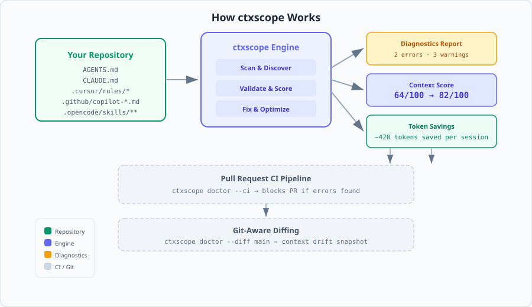
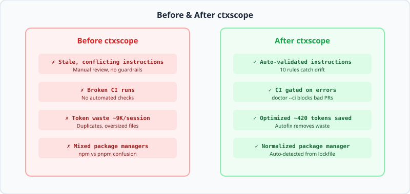

<div align="center">
  

  # ctxscope 

  **Keep AI coding agents in sync with your repository.**

  [](https://www.npmjs.com/package/@x6txy/ctxscope)
  
  [](https://opensource.org/licenses/MIT)
  [](https://opencode.ai)
  [](https://docs.anthropic.com/en/docs/claude-code)
  [](https://github.com/openai/codex)
  [](https://cursor.sh)
</div>

<br/>

Your code changes. Agent instructions often do not.

`ctxscope` is a CLI tool that **generates, checks, fixes, and compares** the context files used by Claude Code, Codex, Cursor, OpenCode, GitHub Copilot, Gemini CLI, and Windsurf. It catches stale commands, conflicting instructions, missing scripts, duplicated context, and unnecessary token usage — before they confuse your agents or break CI.

```bash
npx @x6txy/ctxscope doctor
```

```
Agent Context Score  64/100

ERROR CTX101  AGENTS.md:18
  conflicting package managers: npm, pnpm
  Fix: Normalize package manager commands

ERROR CTX102  AGENTS.md:24
  references missing package script: test:e2e
  Recommendation: remove or replace with an existing package.json script

WARN CTX006  CLAUDE.md:42
  contains a repeated paragraph
  Fix: Remove repeated paragraph

Run ctxscope fix to apply 1 safe fix.
```

---

##  The "Context Drift" Problem

Agent-heavy repositories accumulate instructions across multiple files:

```text
AGENTS.md
CLAUDE.md
.cursor/rules/*
.github/copilot-instructions.md
.opencode/skills/*/SKILL.md
```

As the repository evolves, these files become stale, inconsistent, and expensive. The result is **context drift** — agents receive outdated or conflicting instructions, wasting tokens and producing unreliable output.

`ctxscope` systematically answers:

- Which agent context files exist?
- Are their commands and file references still valid?
- Do different agents receive conflicting instructions?
- How much context is loaded per session?
- What changed compared with `main`?
- Which problems should block CI?
- Which problems can be fixed safely?

<div align="center">
  
</div>

---

##  The Solution

<div align="center">
  
</div>
<br/>

`ctxscope` is a **zero-dependency CLI** that works as a four-stage pipeline:

1. **Scan** — Discover every agent context file in your repository (`AGENTS.md`, `CLAUDE.md`, `.cursor/rules/*`, `.opencode/skills/**`, etc.)
2. **Diagnose** — Run 10+ rules across five categories (Correctness, Freshness, Efficiency, Consistency, Coverage) and produce a health score
3. **Fix** — Apply deterministic autofixes (package manager normalization, duplicate removal) without AI guesswork
4. **Verify** — Compare against Git baseline (`--diff main`) or restrict to working tree changes (`--changed`) to see context drift over time

---

##  Install

```bash
npx @x6txy/ctxscope doctor
```

Or install globally:

```bash
npm install -g @x6txy/ctxscope
ctxscope doctor --changed
```

---

##  Quick Start

### 1. Create or detect agent context

For a new repository:

```bash
npx @x6txy/ctxscope init --agent claude
```

For an existing repository:

```bash
npx @x6txy/ctxscope doctor
```

### 2. Preview safe fixes

```bash
npx @x6txy/ctxscope fix --dry-run
```

### 3. Apply deterministic fixes

```bash
npx @x6txy/ctxscope fix
```

```
Target  /repo
Mode    write

Agent Context Score  64 -> 82
Applied 1 safe fix
Skipped 1 fix
Saved ~420 tokens per session
```

### 4. Check only relevant changes

```bash
npx @x6txy/ctxscope doctor --changed
```

### 5. Compare against the main branch

```bash
npx @x6txy/ctxscope doctor --diff main
```

```
Context Diff

Score: 87 -> 74
Tokens: ~5,900 -> ~7,420 (+1,520)

New problems:
  ERROR CTX102 AGENTS.md:24
    references missing package script: test:e2e

Fixed problems:
  WARN CTX006 CLAUDE.md
    repeated paragraph removed
```

### 6. Protect pull requests

```yaml
- name: Check AI agent context
  run: npx @x6txy/ctxscope doctor --ci
```

---

##  Commands

| Command | Description |
|---|---|
| `scan [path]` | Inventory discovered context files and hygiene warnings |
| `doctor [path]` | Validate correctness, measure health, gate CI |
| `fix [path]` | Apply deterministic safe repairs |
| `generate [path]` | Create context files based on repository facts |
| `init [path]` | Create config file or agent context |
| `top [path]` | Find the largest context sources |
| `cost [path]` | Estimate context overhead per session |
| `explain <code>` | Understand any diagnostic without leaving the terminal |

Run any command with `--help` for full options.

---

##  Supported Agents

| Agent | Status | Files Detected |
|---|---|---|
| Codex | Native | `AGENTS.md`, `**/AGENTS.md` |
| OpenCode | Native | `AGENTS.md`, `**/AGENTS.md`, `.opencode/**/*.md`, `.opencode/skills/**/SKILL.md` |
| Claude Code | Native | `CLAUDE.md`, `**/CLAUDE.md`, `AGENTS.md` |
| Cursor | Pattern-based | `.cursor/rules/**` |
| GitHub Copilot | Pattern-based | `.github/copilot-instructions.md` |
| Gemini CLI | Pattern-based | `GEMINI.md` (`generate` only) |
| Windsurf | Pattern-based | `.windsurf/rules/ctxscope-generated.md` (`generate` only) |
| Generic | Pattern-based | `AGENTS.md`, `CLAUDE.md`, `SKILL.md`, `**/SKILL.md`, `.cursor/rules/**`, `.github/copilot-instructions.md` |

Ignored directories: `.git`, `node_modules`, `dist`.

---

##  Diagnostics

| Code | Severity | Meaning |
|---|---|---|
| `CTX001` | warn | Oversized context file |
| `CTX002` | warn | Duplicate heading across context files |
| `CTX003` | warn | Stale relative markdown link |
| `CTX004` | warn | Empty context file |
| `CTX005` | warn | TODO, FIXME, or obsolete marker |
| `CTX006` | warn | Repeated paragraph (safe autofix) |
| `CTX101` | error | Conflicting package manager instructions (safe autofix) |
| `CTX102` | error | Missing package script referenced by context |
| `CTX103` | warn | Referenced repository path does not exist |
| `CTX104` | warn | Unrecognized command reference |
| `CTX105` | error | Total context budget exceeded |

---

##  Configuration

```bash
ctxscope init --config
```

Creates `ctxscope.config.json`:

```json
{
  "maxTokens": 8000,
  "maxFileTokens": 2500,
  "ignore": ["node_modules", "dist", ".git"],
  "rules": {
    "CTX001": "warn",
    "CTX002": "warn",
    "CTX003": "warn",
    "CTX004": "warn",
    "CTX005": "warn",
    "CTX006": "warn",
    "CTX101": "error",
    "CTX102": "error",
    "CTX105": "error"
  }
}
```

Severity values: `off`, `warn`, `error`.

---

##  FAQ

<details>
<summary><b>"How is this different from just reading the files myself?"</b></summary>
<br/>

You could manually check every context file — but `ctxscope` automates it. It runs 10+ validation rules, calculates a health score, detects cross-file conflicts (e.g., one file says `npm`, another says `pnpm`), estimates token costs, and compares against Git history. It also provides deterministic autofixes and CI integration. Doing all of that by hand for every PR doesn't scale.
</details>

<details>
<summary><b>"Does ctxscope modify my agent files without permission?"</b></summary>
<br/>

No. `ctxscope fix` only runs when explicitly invoked. Use `--dry-run` to preview changes first. Generated files (`ctxscope generate`) respect existing content and require `--force` to overwrite. All fixes are deterministic — no AI-generated edits or magic.
</details>

<details>
<summary><b>"Can I use ctxscope in CI without false positives blocking deploys?"</b></summary>
<br/>

Yes. Configure severity levels per diagnostic code in `ctxscope.config.json`. Set rules you disagree with to `off` or `warn`. Errors exit with code 1 under `--ci` — you control what counts as an error. `doctor --diff main` lets you see context drift without blocking anything.
</details>

<details>
<summary><b>"Does this work with monorepos?"</b></summary>
<br/>

Yes. `ctxscope` scans recursively from any path. Run `ctxscope doctor packages/*` to check individual packages, or point it at the root to scan everything. The `--diff` and `--changed` flags work with any Git ref or working tree.
</details>

<details>
<summary><b>"How accurate are the token estimates?"</b></summary>
<br/>

Token counts use `ceil(character_count / 4)`, which approximates GPT-family tokenization. They are suitable for budgeting and comparison but do not represent exact provider billing. Use `ctxscope cost` to see overhead estimates per session.
</details>

---

##  Safety Model

`ctxscope` is designed for trust over magic.

- All fixes are deterministic and computed from current files at apply time.
- No AI-generated edits or prose.
- `fix` does not modify files unless explicitly invoked.
- Missing script references are recommendations only.
- Generated instruction files are not overwritten without `--force`.
- `doctor --diff` never runs `git checkout` or mutates the working tree.

---

##  Limitations

- Token counts are estimates: `ceil(character_count / 4)`.
- Discovery is pattern-based, not runtime session tracing.
- Semantic checks are conservative. They inspect explicit commands and context text, not model behavior.
- CTX103 (path detection) recognizes common source directory patterns but may miss unconventional path references.
- CTX104 (command detection) uses a built-in allowlist and may produce false positives for custom project-local tools.
- Gemini CLI and Windsurf detection is experimental and limited to `generate`.
- `trace`, cloud dashboard, and AI-powered fixes are future work.

---

<div align="center">
  <br/>
  
  <br/>
  <br/>

  Created by [tuple](https://github.com/x6txy).

  Telegram: [@ncglx](https://t.me/ncglx) &nbsp;·&nbsp; Email: baha200477@gmail.com

  [MIT License](LICENSE)

  <br/>
  <i>Keep your agents honest. Ship with confidence.</i>
</div>
